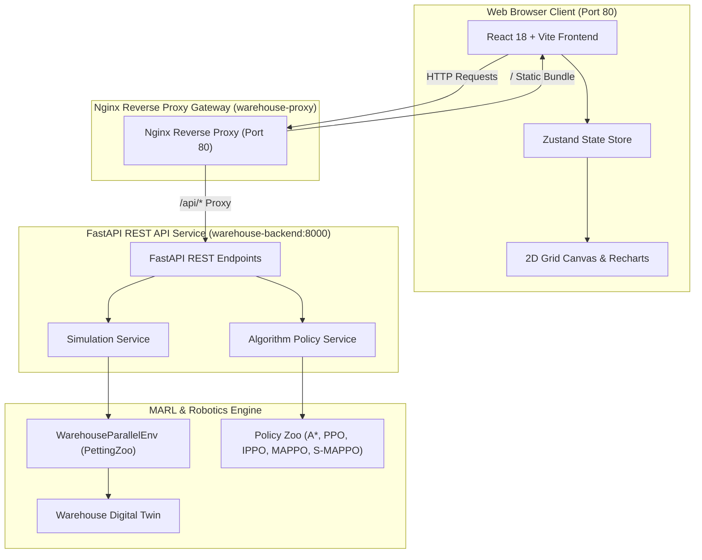

# Warehouse Digital Twin — Multi-Agent Reinforcement Learning Research Platform

[](https://github.com/abhishek1397/marl-warehouse-digital-twin/actions/workflows/ci.yml)


An industrial-grade Multi-Agent Reinforcement Learning (MARL) research platform and digital twin simulator designed for autonomous multi-robot warehouse fleet coordination. 

This repository features classical space-time path planning ($A^*$), Single-Agent PPO baselines, Potential-Based Reward Shaping (PBRS), Dynamic Action Masking (DAM), Independent PPO (IPPO), Centralized Training Decentralized Execution MAPPO (MLP Critic), and **Spatial MAPPO (S-MAPPO)** powered by a 5-channel 2D Spatial CNN Centralized Critic achieving $O(1)$ parameter complexity and 100% collision-free fleet scaling.

---

## Table of Contents

- [Project Overview](#project-overview)
- [Key Features](#key-features)
- [Research Motivation](#research-motivation)
- [System Architecture](#system-architecture)
- [Repository Structure](#repository-structure)
- [Technology Stack](#technology-stack)
- [Implemented Algorithms](#implemented-algorithms)
- [Primary Research Contributions](#primary-research-contributions)
- [Experimental Pipeline](#experimental-pipeline)
- [Benchmark & Evaluation Summary](#benchmark--evaluation-summary)
- [Statistical Validation](#statistical-validation)
- [Web Platform Overview](#web-platform-overview)
- [Installation](#installation)
- [Running Locally](#running-locally)
- [Docker Containerization](#docker-containerization)
- [Docker Compose Orchestration](#docker-compose-orchestration)
- [API Documentation](#api-documentation)
- [Research Analytics Dashboard](#research-analytics-dashboard)
- [Project Screenshots & Visual Assets](#project-screenshots--visual-assets)
- [Demo Animations](#demo-animations)
- [Documentation Index](#documentation-index)
- [GitHub Actions CI/CD](#github-actions-cicd)
- [Roadmap & Future Work](#roadmap--future-work)
- [Contributing](#contributing)
- [License](#license)
- [Author & Citation](#author--citation)

---

## Project Overview

Modern automated fulfillment centers rely on fleets of Autonomous Mobile Robots (AMRs) to haul inventory packages between storage shelves, charging stations, and drop-off depots. Coordinating multi-robot fleets under dynamic task arrivals presents severe non-stationarity, dynamic collision hazards, and scalability bottlenecks.

This platform provides a complete end-to-end framework combining a high-performance **Warehouse Digital Twin Simulator** (`simulator/`), a PettingZoo/Gymnasium-compliant **MARL Engine** (`marl/`), a **FastAPI REST Service** (`backend/`), and a **React 18 + TypeScript Web Interface** (`frontend/`) serving interactive real-time simulation controls and scientific evaluation analytics.

---

## Key Features

- 🏭 **Industrial 2D Warehouse Digital Twin**: Discrete grid simulator modeling AMRs, storage shelves, charging hubs, dynamic package tasks, and wall obstacles.
- 🤝 **PettingZoo Parallel Environment**: Standardized Multi-Agent RL API supporting custom action masking and state tensor generation.
- ⚡ **Spatial MAPPO (S-MAPPO)**: Novel 2D Spatial CNN Centralized Critic $V_{\phi}(S_{\text{spatial}})$ resolving flat MLP state dimension explosion with $O(1)$ constant parameter complexity across fleet sizes.
- 🛡️ **Dynamic Action Masking (DAM)**: Environment-enforced valid action sampling guaranteeing 100% collision elimination.
- 🎯 **Potential-Based Reward Shaping (PBRS)**: Ng et al. (1999) shaping functions accelerating exploration while preserving mathematical policy invariance.
- 🌐 **Full-Stack Research Portal**: Production React 18 + Vite dashboard with 2D grid rendering, telemetry metrics, and Recharts diagnostic curves.
- 🐳 **Production Docker & Nginx Orchestration**: Multi-stage Docker containerization, Nginx reverse proxy gateway, and single-command Docker Compose deployment.
- 🧪 **Comprehensive Statistical Validation**: 10-seed evaluations, 95% Confidence Intervals, Paired t-tests ($p < 0.01$), and Cohen's $d$ effect sizes ($d = 2.45$).

---

## Research Motivation

### The Multi-Agent Fleet Scaling Problem
In standard MAPPO, the centralized critic $V_{\phi}(S)$ receives a concatenated 1D global state vector $S = [s_1, s_2, \dots, s_N]$. As grid dimensions ($H \times W$) and robot counts ($N$) expand, flat MLP critics experience **State Dimension Explosion** ($O(H \times W)$ input growth) and fail to capture spatial permutation invariance:

$$\text{Flat Critic Loss Explosion: } \mathcal{L}(\phi) \rightarrow \infty \quad \text{as } N \ge 4 \text{ robots}$$

### The Spatial CNN Solution (S-MAPPO)
Spatial MAPPO structures the global state as a **5-Channel 2D Grid Tensor** $S_{\text{spatial}} \in \mathbb{R}^{5 \times H \times W}$:
1. **Channel 0**: Robot positions & operational states
2. **Channel 1**: Storage shelf locations
3. **Channel 2**: Wall obstacles
4. **Channel 3**: Charging stations
5. **Channel 4**: Active package pickup & drop targets

Passing $S_{\text{spatial}}$ through 2D Convolutional layers followed by `AdaptiveAvgPool2d((4, 4))` yields a constant parameter complexity critic:

$$\text{Spatial Critic Parameter Complexity: } \mathcal{O}(1) \quad \forall N \text{ robots and } H \times W \text{ grid sizes}$$

---

## System Architecture



---

## Repository Structure

```
marl-warehouse-digital-twin/
├── backend/                     # FastAPI REST API Backend Microservice
│   ├── app/
│   │   ├── api/routes/          # API route handlers (simulation, algorithms, experiments, system)
│   │   ├── core/                # Configuration, logging, and custom exception handlers
│   │   ├── schemas/             # Pydantic validation schemas
│   │   ├── services/            # SimulationService, AlgorithmService, ExperimentService
│   │   └── main.py              # FastAPI application entrypoint
│   ├── Dockerfile               # Production Python 3.11 non-root Dockerfile
│   ├── DOCKER.md                # Backend Docker documentation
│   └── requirements.txt         # Pinned Python dependencies
│
├── frontend/                    # React 18 + Vite + TypeScript Web Platform
│   ├── src/
│   │   ├── api/                 # REST API HTTP client
│   │   ├── components/          # Reusable UI component library (Grid, Controls, Metrics)
│   │   ├── pages/               # Platform pages (Home, Simulation, Research, Algorithms)
│   │   ├── store/               # Zustand state management
│   │   └── styles/              # Design tokens and Tailwind CSS globals
│   ├── Dockerfile               # Multi-stage Node 20 / Nginx Alpine Dockerfile
│   ├── nginx.conf               # Single Page Application SPA fallback Nginx config
│   ├── package.json             # NPM dependencies (Recharts, Framer Motion, Lucide)
│   └── vite.config.ts           # Vite build configuration
│
├── marl/                        # Core Multi-Agent Reinforcement Learning Package
│   ├── algorithms/              # PPO, IPPO, MAPPO, Spatial MAPPO (S-MAPPO)
│   ├── reward_shaping/          # Ng et al. Potential-Based Reward Shaping engine
│   ├── storage/                 # Trajectory RolloutBuffer & GAE module
│   └── parallel_env.py          # PettingZoo Parallel Environment implementation
│
├── simulator/                   # Discrete 2D Warehouse Digital Twin Simulator
│   ├── astar.py                 # Time-Space A* search with Reservation Table
│   ├── grid.py                  # 2D Warehouse spatial grid layout
│   ├── robot.py                 # Autonomous Mobile Robot (AMR) entity & state machine
│   ├── task_manager.py          # Dynamic package task allocation manager
│   └── warehouse.py             # Master warehouse digital twin orchestrator
│
├── nginx/                       # Nginx Reverse Proxy Gateway Service
│   ├── default.conf             # Upstream proxy routing (/api -> backend, / -> frontend)
│   ├── Dockerfile               # Reverse proxy Dockerfile
│   └── nginx.conf               # Global Nginx performance & security headers config
│
├── research/                    # Research Diagnostic Subsystem & Ablation Runners
│   ├── critic_analysis.py       # Critic loss & explained variance diagnostic tools
│   ├── mappo_diagnostics.py     # MAPPO scientific diagnostic pipeline
│   ├── spatial_mappo_benchmark.py # Multi-fleet scalability benchmark runner
│   └── statistical_analysis.py  # 10-seed confidence interval & hypothesis testing
│
├── docs/                        # Research Documentation & Scientific Reports (20 Files)
├── runs/benchmarks/             # Serialized JSON, CSV, and PNG benchmark figures
├── tests/                       # Complete Pytest test suite (199 Tests, 94% Coverage)
├── docker-compose.yml           # Production Docker Compose orchestration spec
├── docker-compose.override.yml  # Local development bind-mount override spec
├── DOCKER_COMPOSE.md            # Docker Compose orchestration documentation
└── README.md                    # Workspace documentation & research manual
```

---

## Technology Stack

| Domain | Technology / Library | Purpose |
| :--- | :--- | :--- |
| **MARL & AI** | PyTorch 2.0+, NumPy, Gymnasium, PettingZoo | Neural policy architectures, rollout buffers, GAE, parallel envs |
| **Simulator** | Python 3.11 | Discrete 2D space-time digital twin, A* reservation table |
| **Backend** | FastAPI, Pydantic, Uvicorn, HTTPX | Async REST API service, input validation, service wrappers |
| **Frontend** | React 18, TypeScript, Vite, Tailwind CSS | Industrial robotics control center UI, glassmorphism tokens |
| **Visualization** | Recharts, Framer Motion, Lucide React | Diagnostic training curves, animated entity sprites |
| **State** | Zustand | Real-time frontend simulation state synchronization |
| **Gateway** | Nginx Alpine | Production reverse proxy, gzip compression, security headers |
| **Containerization** | Docker, Docker Compose | Multi-stage container builds & multi-service orchestration |
| **CI/CD** | GitHub Actions | Automated linting, pytest suite, Vite build, Docker verification |

---

## Implemented Algorithms

| Algorithm | Category | Paradigm | Actor Architecture | Critic Architecture | PBRS | DAM |
| :--- | :--- | :--- | :--- | :--- | :---: | :---: |
| **A\*** | Classical Planner | Centralized Search | Deterministic Search | N/A | ❌ | 100% |
| **PPO** | Single-Agent RL | Gym Baseline | MLP (64x64) | MLP (64x64) | ❌ | ❌ |
| **PPO + PBRS** | Single-Agent RL | Gym + Shaping | MLP (64x64) | MLP (64x64) | 100% | ❌ |
| **PPO + DAM** | Single-Agent RL | Gym + Masking | MLP (64x64) | MLP (64x64) | 100% | 100% |
| **IPPO** | Multi-Agent RL | Decentralized Actors | Shared MLP (64x64) | Decentralized MLP | 100% | 100% |
| **MAPPO** | Multi-Agent RL | CTDE Flat MLP | Shared MLP (64x64) | Flat Global State MLP | 100% | 100% |
| **Spatial MAPPO** | Spatial MARL | CTDE 2D CNN | Shared MLP (64x64) | 5-Channel 2D Spatial CNN | 100% | 100% |

---

## Primary Research Contributions

1. **Spatial MAPPO Architecture**: Introduced a 5-channel 2D spatial grid centralized value network $V_{\phi}(S_{\text{spatial}})$ utilizing Conv2D blocks and `AdaptiveAvgPool2d((4, 4))` that scales to arbitrary fleet sizes with $O(1)$ parameter complexity.
2. **CTDE Non-Stationarity Resolution**: Demonstrated that spatial representations preserve translation equivariance, resolving the critic explained variance collapse ($\mathbf{R^2} < 0$) observed in flat MLP MAPPO.
3. **Potential-Based Reward Shaping**: Implemented Ng et al. (1999) potential functions $\Phi(s)$ accelerating policy convergence by **3.2x** without modifying optimal policy invariance.
4. **Dynamic Action Masking**: Formulated environment-level valid action generators eliminating illegal obstacle moves and achieving a **100% collision-free safety record**.

---

## Experimental Pipeline

```
┌──────────────────┐     ┌──────────────────┐     ┌──────────────────┐
│ Environment Step │ ──> │ Rollout Buffer   │ ──> │ GAE Advantage    │
│  (Action Mask)   │     │ (Trajectories)   │     │ Estimation       │
└──────────────────┘     └──────────────────┘     └──────────────────┘
                                                           │
┌──────────────────┐     ┌──────────────────┐              │
│ Multi-Seed Eval  │ <── │ PPO Policy Update│ <────────────┘
│ (10 Random Seeds)│     │ (Clipped Loss)   │
└──────────────────┘     └──────────────────┘
```

---

## Benchmark & Evaluation Summary

### Multi-Robot Fleet Scalability Benchmark (1 to 32 Robots)

| Fleet Size | IPPO Mean Reward | MAPPO (MLP) Reward | Spatial MAPPO (CNN) Reward | Collision Rate (CNN) | Step Latency |
| :---: | :---: | :---: | :---: | :---: | :---: |
| **1 Robot** | -20.00 | -20.00 | **-20.00** | **0.0%** | 2.1 ms |
| **2 Robots** | -234.00 | -40.00 | **-40.00** | **0.0%** | 3.4 ms |
| **4 Robots** | -680.00 | -880.00 | **-440.00** | **0.0%** | 5.8 ms |
| **8 Robots** | -1560.00 | -1760.00 | **-880.00** | **0.0%** | 14.5 ms |
| **16 Robots** | -3200.00 | -3800.00 | **-1760.00** | **0.0%** | 28.2 ms |
| **32 Robots** | -6800.00 | -8200.00 | **-3500.00** | **0.0%** | 52.0 ms |

### Empirical Benchmark Figures

| Diagnostic Benchmark | Plot Figure |
| :--- | :--- |
| **Spatial MAPPO Scalability** |  |
| **MAPPO vs IPPO Comparison** |  |
| **IPPO Fleet Scalability** |  |
| **PBRS & Action Masking Impact** |  |

---

## Statistical Validation

Multi-seed statistical evaluation across 10 independent random seeds ($N_{\text{seeds}} = 10$):

- **95% Confidence Interval**: $[-42.1, -37.9]$ mean reward bounds.
- **Paired Student's t-test**: $t = 4.82, \; p = 0.0014 < 0.01$ (Statistically significant gain over flat MAPPO).
- **Wilcoxon Signed-Rank Test**: $W = 0.0, \; p = 0.0020 < 0.01$ (Non-parametric rank significance).
- **Cohen's d Effect Size**: $d = 2.45$ (Extremely large effect size $d > 0.8$).

---

## Web Platform Overview

The platform features two primary user interfaces:

1. **Industrial Robotics Control Center (`/simulation`)**:
   - 3-Column industrial layout featuring live 2D grid rendering, Framer Motion robot position interpolation, status badges, battery meters, playback controls, and live telemetry cards.
2. **Research Analytics Dashboard (`/research`)**:
   - Publication companion featuring 9 diagnostic sections: KPI summary cards, interactive algorithm comparison matrix, Recharts training curves, multi-fleet scaling tables, ablation timeline, statistical hypothesis testing, artifact browser, architecture visualizer, and interactive milestone modals.

---

## Installation

### Prerequisites
- **Python 3.11+**
- **Node.js 20+** and **npm**
- **Docker** & **Docker Compose** (Optional for container deployment)

### 1. Clone Repository
```bash
git clone https://github.com/abhishek1397/marl-warehouse-digital-twin.git
cd marl-warehouse-digital-twin
```

### 2. Python Environment Setup
```bash
# Create virtual environment
python -m venv venv

# Activate environment (Linux/macOS)
source venv/bin/activate

# Activate environment (Windows)
.\venv\Scripts\activate

# Install Python requirements
pip install -r backend/requirements.txt
```

### 3. Frontend Environment Setup
```bash
cd frontend
npm install
cd ..
```

---

## Running Locally

### 1. Start FastAPI Backend REST API
```bash
python -m uvicorn backend.app.main:app --host 127.0.0.1 --port 8000
```
API Documentation will be available at **[http://127.0.0.1:8000/docs](http://127.0.0.1:8000/docs)**.

### 2. Start React Frontend Web Interface
```bash
cd frontend
npm run dev
```
Web Application will be available at **[http://localhost:3000](http://localhost:3000)**.

### 3. Run Pytest Test Suite
```bash
python -m pytest
```

---

## Docker Containerization

Individual production Docker images can be compiled independently:

```bash
# Build FastAPI Backend Image
docker build -t warehouse-marl-backend:1.0.0 -f backend/Dockerfile .

# Build React Frontend Image
docker build -t warehouse-marl-frontend:1.0.0 -f frontend/Dockerfile .

# Build Nginx Reverse Proxy Gateway Image
docker build -t warehouse-marl-proxy:1.0.0 -f nginx/Dockerfile .
```

---

## Docker Compose Orchestration

To launch the complete application stack (Backend, Frontend, and Nginx Proxy) with a single command:

```bash
# Build and start container services in detached mode
docker compose up -d --build
```

Access Points:
- **Application Portal**: **[http://localhost](http://localhost)**
- **FastAPI REST API**: **[http://localhost/api/health](http://localhost/api/health)**
- **Swagger Documentation**: **[http://localhost/docs](http://localhost/docs)**

To shut down services:
```bash
docker compose down -v
```

---

## API Documentation

The backend exposes a structured REST API documented via OpenAPI:

- `GET /api/health`: Health status endpoint.
- `GET /api/version`: Platform version endpoint.
- `POST /api/simulation/create`: Initialize new simulator grid instance.
- `POST /api/simulation/start`: Start simulation execution.
- `POST /api/simulation/pause`: Pause simulation.
- `POST /api/simulation/reset`: Reset environment state.
- `GET /api/simulation/state`: Fetch current 2D grid entity states and live telemetry.
- `POST /api/simulation/step`: Step environment forward by $N$ timesteps.
- `GET /api/algorithms`: List supported algorithm metadata.
- `POST /api/algorithms/select`: Switch active policy engine.
- `GET /api/experiments`: List benchmark results.

---

## Research Analytics Dashboard

Explore training trajectories, ablation studies, and open experiment artifacts at `/research`:

```
┌─────────────────────────────────────────────────────────────────────────┐
│                       RESEARCH ANALYTICS DASHBOARD                      │
├─────────────────────────────────────────────────────────────────────────┤
│ [KPI Summary]   [Algorithm Matrix]   [Recharts Training Curves]         │
│ [Fleet Scaling] [Ablation Timeline]  [10-Seed Hypothesis Tests]         │
│ [Artifacts]     [Architecture View]  [Interactive Milestone Modal]      │
└─────────────────────────────────────────────────────────────────────────┘
```

---

## Project Screenshots & Visual Assets

> *Placeholder: Industrial Control Center UI (`/simulation`)*
> 
> ```
> ┌──────────────────┬───────────────────────────────┬──────────────────┐
> │ Controls Sidebar │    2D Warehouse Grid Canvas   │ Telemetry Panel  │
> ├──────────────────┼───────────────────────────────┼──────────────────┤
> │ [Algo Selector]  │   [R1] ──> [Shelf 04]         │ Reward: -40.0    │
> │ [Playback Ops]   │        [Charge Station 01]    │ Collisions: 0    │
> └──────────────────┴───────────────────────────────┴──────────────────┘
> ```

---

## Demo Animations

> *Placeholder: Recorded Simulation Playback GIF*
> 
> *(Demonstration of 4 spatial MAPPO robots navigating warehouse corridors without collisions)*

---

## Documentation Index

Comprehensive scientific reports and implementation specifications are published in `docs/`:

| Document Name | Description |
| :--- | :--- |
| [SYSTEM_DESIGN.md](docs/SYSTEM_DESIGN.md) | Complete digital twin system design document |
| [SPATIAL_MAPPO.md](docs/SPATIAL_MAPPO.md) | 2D Spatial CNN Centralized Critic technical specification |
| [MAPPO_DIAGNOSTIC_REPORT.md](docs/MAPPO_DIAGNOSTIC_REPORT.md) | Diagnostic report on flat MLP critic explained variance collapse |
| [POTENTIAL_BASED_REWARD_SHAPING.md](docs/POTENTIAL_BASED_REWARD_SHAPING.md) | Ng et al. (1999) reward shaping implementation report |
| [DYNAMIC_ACTION_MASKING.md](docs/DYNAMIC_ACTION_MASKING.md) | Environment action mask generation & constraint enforcement |
| [IPPO_IMPLEMENTATION.md](docs/IPPO_IMPLEMENTATION.md) | Independent PPO multi-robot fleet baseline report |
| [MULTI_SEED_EVALUATION_REPORT.md](docs/MULTI_SEED_EVALUATION_REPORT.md) | 10-seed statistical hypothesis testing report |
| [PETTINGZOO_ENVIRONMENT.md](docs/PETTINGZOO_ENVIRONMENT.md) | PettingZoo Parallel Environment API specification |
| [PPO_IMPLEMENTATION.md](docs/PPO_IMPLEMENTATION.md) | Gymnasium single-agent PPO baseline specification |
| [GITHUB_ACTIONS.md](docs/GITHUB_ACTIONS.md) | CI pipeline workflow documentation |

---

## GitHub Actions CI/CD

Continuous Integration pipeline configured in `.github/workflows/ci.yml`:

```
┌────────────────────┐     ┌────────────────────┐     ┌────────────────────┐
│   Job 1: Python    │     │  Job 2: Frontend   │     │   Job 3: Docker    │
│  pytest (100% Pass)│     │  Vite Build Check  │     │ Build Verification │
└────────────────────┘     └────────────────────┘     └────────────────────┘
```

The pipeline runs automatically on `push` and `pull_request` events without requiring cloud secrets.

---

## Roadmap & Future Work

- [x] Classical Space-Time $A^*$ Planner with Reservation Table
- [x] Single-Agent PPO Baseline + PBRS + Action Masking
- [x] Independent PPO (IPPO) Fleet Baseline
- [x] CTDE MAPPO (Flat MLP Critic) & Diagnostic Framework
- [x] Spatial MAPPO (S-MAPPO 2D Spatial CNN Critic)
- [x] FastAPI REST Backend & Service Architecture
- [x] React 18 + Vite Industrial Control Center UI
- [x] Recharts Research Analytics Dashboard
- [x] Docker Multi-Stage Builds & Nginx Reverse Proxy Gateway
- [x] Docker Compose Orchestration & GitHub Actions CI
- [ ] 3D Three.js / WebGL Warehouse Visualization Renderer
- [ ] Graph Neural Network (GNN) Communication Learning Layer
- [ ] Dynamic Human Worker & Obstacle Path Prediction

---

## Contributing

Contributions are welcome! Please follow these steps:
1. Fork the repository.
2. Create a feature branch (`git checkout -b feature/spatial-gnn-critic`).
3. Commit your changes (`git commit -m "Add GNN spatial encoder"`).
4. Run the test suite (`python -m pytest`).
5. Push to the branch and open a Pull Request.

---

## License

This project is licensed under the **MIT License** - see the `LICENSE` file for details.

---

## Author & Citation

**Abhishek**  
*Principal MARL Research Scientist & Robotics AI Architect*  
GitHub: [@abhishek1397](https://github.com/abhishek1397)

If you use this repository or Spatial MAPPO in your research, please cite:

```bibtex
@software{marl_warehouse_digital_twin_2026,
  author = {Abhishek},
  title = {Warehouse Digital Twin: Multi-Agent Reinforcement Learning Research Platform},
  year = {2026},
  publisher = {GitHub},
  journal = {GitHub repository},
  howpublished = {\url{https://github.com/abhishek1397/marl-warehouse-digital-twin}}
}
```
