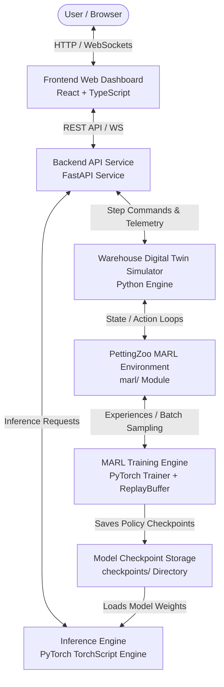
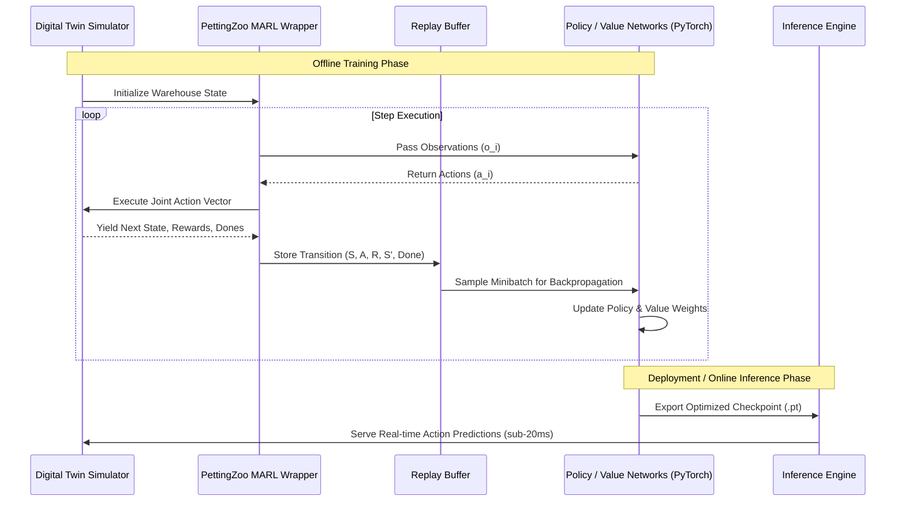
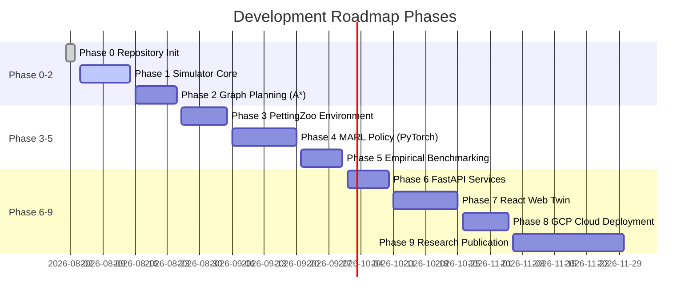

# SYSTEM DESIGN SPECIFICATION

**Project Title:** Cloud-Native Multi-Agent Reinforcement Learning Warehouse Digital Twin for Intelligent Robot Coordination  
**Document Version:** 1.0.0  
**Status:** Approved Architectural Specification (Single Source of Truth)  
**Target Environment:** Python 3.11 (`marl_env`), Cloud-Native Microservices, PyTorch, PettingZoo, FastAPI, React+TypeScript  

---

## 1. Project Vision

### Problem Statement
Automated warehouse environments demand real-time, collision-free, and energy-efficient coordination among large fleets of Autonomous Mobile Robots (AMRs). Classical centralized pathfinding algorithms (such as Multi-Agent $A^*$ and Conflict-Based Search) experience exponential computational growth $O(k^N)$ as fleet size $N$ increases. Rule-based dispatch systems fail to handle dynamic bottlenecks, non-deterministic task generation, battery depletion curves, and localized congestion, leading to deadlocks, severe throughput drops, and high operational costs.

### Motivation
Recent advances in Multi-Agent Reinforcement Learning (MARL) demonstrate that decentralized policy execution—where each robot chooses actions based on local observations while maintaining a global team objective—can effectively overcome computational scalability bottlenecks. However, existing MARL benchmarks lack cloud-native digital twin integration, real-time spatial physics telemetry, dynamic task allocation mechanisms, and web-based monitoring dashboards suitable for production deployment and high-impact academic research.

### Objectives
1. **High-Fidelity Digital Twin:** Design a discrete-event 2D warehouse simulator modeling spatial grids, obstacle topologies, pickup/drop zones, shelf racking systems, and dynamic battery/kinematic physics.
2. **Hybrid Motion Planning & MARL Coordination:** Synthesize deterministic graph search ($A^*$, BFS) with deep multi-agent policies (MAPPO, QMIX) for safe path execution, energy-aware routing, and dynamic deadlock avoidance.
3. **Cloud-Native Web Ecosystem:** Expose RESTful/WebSocket telemetry via FastAPI, decoupled simulation workers, dynamic dashboard visualization in React + TypeScript, and automated CI/CD cloud container deployment.
4. **Academic & Industry Standard:** Provide a benchmark platform suited for MTech dissertations, top-tier conference publications (IEEE/Springer), portfolio demonstrations, and production-ready architectural patterns.

### Expected Deliverables
* Complete architectural and functional documentation (`SYSTEM_DESIGN.md`, `README.md`).
* Modular Python simulation package (`simulator/`).
* MARL environment wrappers and PyTorch algorithm pipelines (`marl/`).
* Asynchronous REST/WebSocket API service backend (`backend/`).
* React + TypeScript interactive Digital Twin frontend (`frontend/`).
* Automated testing, evaluation suite, and cloud deployment pipelines (`deployment/`, `tests/`).

### Project Scope
* **In-Scope:** 2D grid kinematics, differential drive robot abstractions, discrete action spaces, battery degradation modeling, static/dynamic obstacle avoidance, multi-agent policy training, web visualization, API services, containerized cloud infrastructure.
* **Out-of-Scope:** 3D rigid-body collision meshes (e.g., Isaac Sim/PyBullet physics engines), physical ROS hardware driver creation, continuous low-level motor voltage control.

### Success Criteria
* Zero multi-robot spatial collisions during deterministic path execution and policy evaluation.
* At least $35\%$ higher task completion throughput compared to single-agent greedy $A^*$ baselines in high-density grid scenarios.
* Near-linear computational execution time per simulation step during inference ($<50\text{ ms}$ step latency for 50 robots).
* Sub-100ms API response latency for real-time telemetry rendering on the web dashboard.

---

## 2. Functional Requirements

### FR-1: Robot Management
* System shall register, track, and update robot positions $(x, y)$, heading angles $\theta$, velocities, load states (empty, carrying shelf/package), and battery levels ($0\% - 100\%$).
* System shall handle robot operational state transitions (`IDLE`, `NAVIGATING`, `PICKING`, `DROPPING`, `CHARGING`, `ERROR`).

### FR-2: Warehouse Management
* System shall maintain a 2D grid matrix containing walkable cells, static shelf structures, pickup stations, drop-off stations, charging hubs, and obstacle boundaries.
* System shall dynamically reflect inventory placement and status across all storage racks.

### FR-3: Task Allocation
* System shall accept task requests (e.g., transport Item $A$ from Pickup Zone $P_1$ to Storage Shelf $S_5$) and assign tasks to available `IDLE` robots based on proximity, battery capacity, and current task queue.

### FR-4: Collision Handling
* System shall enforce spatial exclusivity: no two robots may occupy the exact grid cell at the same discrete time step.
* System shall detect potential edge collisions (two robots swapping adjacent cells simultaneously) and trigger collision avoidance protocols.

### FR-5: Battery Charging
* System shall compute battery consumption as a function of distance traveled, payload weight, and idle time.
* System shall automatically route robots with battery levels below a critical threshold ($\le 20\%$) to the nearest unoccupied charging station.

### FR-6: Path Planning
* System shall calculate initial optimal paths using classical graph search ($A^*$) and recalculate paths when dynamic obstacles or deadlocks are detected.

### FR-7: Simulation Engine
* System shall step through discrete time intervals ($\Delta t$), updating robot states, task queues, collision conditions, and world state variables synchronously or asynchronously.

### FR-8: MARL Training
* System shall expose standard Gymnasium/PettingZoo environments to train multi-agent policies using global state representations, local observations, and structured team/individual rewards.

### FR-9: Deployment & Serving
* System shall provide inference APIs capable of serving trained MARL neural network policies for real-time robot fleet action selection.

### FR-10: Visualization & Telemetry
* System shall stream real-time spatial positions, path reservations, robot statuses, and metrics to an interactive web frontend dashboard.

---

## 3. Non-Functional Requirements

### NFR-1: Scalability
* System architecture shall support scaling up to 100 concurrent autonomous mobile robots on a $100 \times 100$ warehouse grid layout without state corruption.

### NFR-2: Performance & Low Latency
* Step evaluation latency of the simulation engine shall remain under $50\text{ ms}$ for 50 agents.
* Neural network inference endpoint latency shall remain under $20\text{ ms}$ per batch request.

### NFR-3: Maintainability & Modular Architecture
* System shall strictly follow Object-Oriented and Clean Architecture principles, decoupling simulation core logic from API frameworks, RL libraries, and web frontends.

### NFR-4: Extensibility
* System shall enable researchers to plug in custom pathfinding algorithms, MARL reward functions, robot kinematic models, or custom environment configurations without modifying core simulation loops.

### NFR-5: Reliability & Robustness
* System shall gracefully recover from agent deadlocks by triggering local rerouting or task reassignment without crashing the simulation engine.

### NFR-6: Cloud Compatibility
* Application components shall be stateless and fully containerizable via Docker for deployment on cloud platforms (e.g., GCP Cloud Run, Kubernetes).

---

## 4. Warehouse Specification

### Warehouse Grid Topology
* Matrix dimensions: $W \times H$ (Default: $50 \times 50$ cells, where each cell represents a $1\text{m} \times 1\text{m}$ area).
* Coordinate system: Origin $(0, 0)$ at Top-Left; $x$-axis extends horizontally right, $y$-axis extends vertically down.

### Key Functional Components
1. **Shelves / Storage Racks:** Fixed rectangular grid blocks reserved for inventory storage. Walkways exist between shelf aisles.
2. **Pickup Stations:** Dedicated grid cells along warehouse boundaries where incoming goods enter the system.
3. **Drop-Off Stations:** Outbound processing cells where robots deliver requested packages/shelves.
4. **Charging Hubs:** Specialized cells equipped with power chargers that replenish robot battery capacity at $5\%$ per discrete time step.
5. **Obstacles:** Permanent structural columns, walls, or temporary restricted zones non-traversable by robots.

### Robot Constraints & Kinematics
* **Action Space:** Discrete actions $\{\text{MOVE\_NORTH}, \text{MOVE\_SOUTH}, \text{MOVE\_EAST}, \text{MOVE\_WEST}, \text{STAY}, \text{PICK\_UP}, \text{DROP_OFF}\}$.
* **Movement Cost:** Moving spends $1.0\%$ battery per cell without payload, $1.5\%$ battery per cell under load.
* **Payload Capacity:** 1 item/shelf per robot at a time.

### Simulation Assumptions
* Time is discretized into uniform time steps ($t = 0, 1, 2, \dots$).
* All actions attempted within step $t$ are processed synchronously by the simulation state transition engine.

---

## 5. Object Model

This section details every planned class across the system architecture.

```
                  +-------------------+
                  |     Warehouse     |
                  +-------------------+
                  | - grid: Grid      |
                  | - robots: List    |
                  +-------------------+
                            |
        +-------------------+-------------------+
        |                   |                   |
        v                   v                   v
  +-----------+       +-----------+       +-----------+
  |   Robot   |       |   Shelf   |       |  Package  |
  +-----------+       +-----------+       +-----------+
        |
        v
  +---------------------------------+
  |        AStarPlanner             |
  +---------------------------------+
```

### Class Specifications

#### 1. `Warehouse`
* **Purpose:** Represents the top-level digital twin container holding all structural elements and dynamic entities.
* **Responsibilities:** Manages layout instantiation, entity placement, time step increments, and environmental state querying.
* **Attributes:** `width: int`, `height: int`, `grid: Grid`, `robots: Dict[str, Robot]`, `shelves: Dict[str, Shelf]`, `pickup_zones: List[Tuple[int, int]]`, `drop_zones: List[Tuple[int, int]]`, `charging_stations: List[ChargingStation]`.
* **Methods:** `initialize_layout()`, `get_state()`, `step()`, `reset()`, `add_robot()`.
* **Relationships:** Aggregates `Grid`, `Robot`, `Shelf`, `Package`, `Task`, `ChargingStation`, and `Obstacle`.

#### 2. `Grid`
* **Purpose:** Represents the 2D spatial matrix of the warehouse floor.
* **Responsibilities:** Checks boundary bounds, cell occupancy, collision risks, and cell types.
* **Attributes:** `rows: int`, `cols: int`, `matrix: List[List[int]]`, `occupancy_map: Dict[Tuple[int, int], str]`.
* **Methods:** `is_walkable(x, y)`, `is_occupied(x, y)`, `reserve_cell(x, y, entity_id)`, `release_cell(x, y)`.
* **Relationships:** Owned by `Warehouse`.

#### 3. `Robot`
* **Purpose:** Models individual Autonomous Mobile Robot (AMR) state and capabilities.
* **Responsibilities:** Tracks position, battery level, current path, task payload, and state transitions.
* **Attributes:** `id: str`, `position: Tuple[int, int]`, `heading: int`, `battery: float`, `status: RobotStatus`, `current_task: Optional[Task]`, `assigned_path: List[Tuple[int, int]]`, `payload: Optional[Package]`.
* **Methods:** `move_to(position)`, `consume_battery()`, `charge()`, `assign_task(task)`, `has_low_battery()`.
* **Relationships:** Assigned to `Warehouse`; holds reference to `Task` and `Package`.

#### 4. `Shelf`
* **Purpose:** Represents storage racks in the warehouse.
* **Responsibilities:** Tracks rack location, stored inventory, and lift status.
* **Attributes:** `id: str`, `position: Tuple[int, int]`, `is_lifted: bool`, `stored_packages: List[Package]`.
* **Methods:** `lift()`, `lower()`, `add_package()`, `remove_package()`.
* **Relationships:** Positioned on `Grid`; referenced by `Warehouse`.

#### 5. `Package`
* **Purpose:** Represents inventory items transported through the warehouse.
* **Responsibilities:** Holds item metadata, weight, source pickup station, and target drop-off station.
* **Attributes:** `id: str`, `weight: float`, `origin: Tuple[int, int]`, `destination: Tuple[int, int]`, `status: PackageStatus`.
* **Methods:** `update_status(status)`.
* **Relationships:** Carried by `Robot` or stored in `Shelf`.

#### 6. `Task`
* **Purpose:** Encapsulates a transport order within the warehouse system.
* **Responsibilities:** Tracks order fulfillment life cycle from creation to completion.
* **Attributes:** `id: str`, `package: Package`, `assigned_robot_id: Optional[str]`, `priority: int`, `state: TaskState`, `created_at: float`.
* **Methods:** `assign_to_robot(robot_id)`, `complete_task()`, `cancel_task()`.
* **Relationships:** References `Package` and `Robot`.

#### 7. `ChargingStation`
* **Purpose:** Models power charging stations.
* **Responsibilities:** Tracks charging station availability, occupancy, and charging rate.
* **Attributes:** `id: str`, `position: Tuple[int, int]`, `is_occupied: bool`, `occupying_robot_id: Optional[str]`, `charge_rate: float`.
* **Methods:** `dock_robot(robot_id)`, `undock_robot()`, `is_available()`.
* **Relationships:** Positioned on `Grid`; interacts with `Robot`.

#### 8. `Obstacle`
* **Purpose:** Represents structural walls or non-traversable grid areas.
* **Responsibilities:** Provides collision bounds.
* **Attributes:** `id: str`, `coordinates: List[Tuple[int, int]]`.
* **Methods:** `blocks_position(x, y)`.
* **Relationships:** Registered on `Grid`.

#### 9. `Simulation`
* **Purpose:** Orchestrates the temporal loop and physics updates of the warehouse digital twin.
* **Responsibilities:** Advances time steps, calls collision detection, resolves movement conflicts, and broadcasts state telemetry.
* **Attributes:** `warehouse: Warehouse`, `collision_detector: CollisionDetector`, `time_step: int`, `is_running: bool`, `metrics: Dict`.
* **Methods:** `start()`, `pause()`, `step()`, `get_telemetry()`.
* **Relationships:** Manages `Warehouse`, `CollisionDetector`, and `AStarPlanner`.

#### 10. `CollisionDetector`
* **Purpose:** Real-time spatial collision identification engine.
* **Responsibilities:** Detects cell-occupation overlaps and simultaneous edge-swapping conflicts between agents.
* **Attributes:** `grid: Grid`.
* **Methods:** `check_vertex_collisions(positions)`, `check_edge_collisions(previous_positions, new_positions)`.
* **Relationships:** Queries `Grid` and `Robot` coordinates.

#### 11. `AStarPlanner`
* **Purpose:** Classical deterministic graph path planning service.
* **Responsibilities:** Calculates optimal grid routes from source to destination using $A^*$ search with Manhattan distance heuristics.
* **Attributes:** `grid: Grid`.
* **Methods:** `find_path(start, goal, dynamic_obstacles)`, `heuristic(a, b)`.
* **Relationships:** Reads `Grid` obstacles; yields path sequences to `Robot`.

#### 12. `Environment`
* **Purpose:** Gymnasium/PettingZoo interface wrapper around `Simulation`.
* **Responsibilities:** Translates simulation state into MARL observations, receives multi-agent action vectors, calculates rewards, and yields step tuples.
* **Attributes:** `simulation: Simulation`, `observation_spaces: Dict`, `action_spaces: Dict`.
* **Methods:** `reset()`, `step(actions)`, `observe(agent_id)`, `compute_rewards()`.
* **Relationships:** Wraps `Simulation`; feeds data to `ReplayBuffer` and `Trainer`.

#### 13. `ReplayBuffer`
* **Purpose:** Multi-agent experience replay storage for RL training.
* **Responsibilities:** Stores joint transitions $(S, A, R, S', \text{done})$ and draws randomized batch samples for network optimization.
* **Attributes:** `capacity: int`, `buffer: List[Transition]`, `ptr: int`.
* **Methods:** `push(state, action, reward, next_state, done)`, `sample(batch_size)`.
* **Relationships:** Used by `Trainer`.

#### 14. `PolicyNetwork`
* **Purpose:** PyTorch Neural Network module generating action probabilities/Q-values.
* **Responsibilities:** Processes agent observation inputs through MLP/CNN layers to output policy distribution over discrete actions.
* **Attributes:** `input_dim: int`, `action_dim: int`, `network: torch.nn.Module`.
* **Methods:** `forward(obs)`, `get_action(obs)`.
* **Relationships:** Evaluated by `Trainer` and `InferenceEngine`.

#### 15. `Trainer`
* **Purpose:** Executes deep MARL optimization loops (e.g., MAPPO / QMIX).
* **Responsibilities:** Computes loss functions, updates policy/value weights via backpropagation, updates target networks, and logs progress.
* **Attributes:** `policy_network: PolicyNetwork`, `value_network: PolicyNetwork`, `optimizer: torch.optim.Optimizer`, `replay_buffer: ReplayBuffer`.
* **Methods:** `train_step()`, `update_targets()`, `save_checkpoint(path)`.
* **Relationships:** Updates `PolicyNetwork`; reads `ReplayBuffer`.

#### 16. `Evaluator`
* **Purpose:** Evaluates trained MARL models against classical baselines.
* **Responsibilities:** Runs non-training evaluation episodes, collects operational metrics, and generates benchmark summaries.
* **Attributes:** `environment: Environment`, `policy_network: PolicyNetwork`.
* **Methods:** `run_evaluation(episodes)`, `compute_metrics()`.
* **Relationships:** Tests `Environment` using `PolicyNetwork`.

#### 17. `APIService`
* **Purpose:** FastAPI backend REST/WebSocket server interface.
* **Responsibilities:** Handles API routes (`/predict`, `/simulate`, `/metrics`), manages WebSocket telemetry broadcasts, and interfaces with `Simulation`.
* **Attributes:** `simulation_instance: Simulation`, `inference_engine: PolicyNetwork`.
* **Methods:** `handle_predict(request)`, `handle_simulate(request)`, `stream_telemetry(websocket)`.
* **Relationships:** Exposes `Simulation` and `PolicyNetwork` over HTTP/WebSocket.

#### 18. `FrontendDashboard`
* **Purpose:** React + TypeScript single-page client visualization interface.
* **Responsibilities:** Renders the 2D digital twin grid, controls simulation execution, plots performance charts, and configures settings.
* **Attributes:** `websocket_client: WebSocket`, `grid_renderer: CanvasRenderer`, `state: DashboardState`.
* **Methods:** `connect_websocket()`, `render_grid()`, `update_robot_markers()`.
* **Relationships:** Consumes `APIService` endpoints.

---

## 6. High Level Architecture

The system follows a multi-tier microservice architecture separating web rendering, backend routing, policy inference, discrete simulation physics, and offline/online model training.

### Data Flow Diagram



---

## 7. MARL Design

### State Space ($S$)
The global environmental state $S_t$ contains complete spatial awareness:
* Grid dimension matrix ($W \times H$).
* All robot positions, headings, speeds, battery levels, and cargo statuses.
* All shelf positions and package fulfillment statuses.
* Active path reservations and target destination allocations.

### Observation Space ($O_i$)
Each robot $i$ receives a localized observation vector $o_{i, t}$ within a limited perception radius $R$ (e.g., $7 \times 7$ grid window around the robot):
* Local grid occupancy matrix ($7 \times 7$ binary image indicating walls/obstacles).
* Local neighbor robot matrix (relative positions and velocities of nearby robots).
* Relative coordinates to assigned goal $(\Delta x_{goal}, \Delta y_{goal})$.
* Current robot status (normalized battery level, payload binary indicator).

### Action Space ($A_i$)
Discrete multi-agent action space for each agent $i$:
$$A_i = \{\text{0: STAY}, \text{1: MOVE\_NORTH}, \text{2: MOVE\_SOUTH}, \text{3: MOVE\_EAST}, \text{4: MOVE\_WEST}, \text{5: PICK\_UP}, \text{6: DROP\_OFF}\}$$

### Reward Function Structure ($R_i$)
The reward function combines global team efficiency rewards with localized safety penalties:
* **Step Penalty:** $-0.1$ per step to encourage minimum path duration.
* **Goal Reached:** $+100.0$ upon delivering a package/shelf to its target destination.
* **Collision Penalty:** $-50.0$ for colliding with another robot or obstacle.
* **Low Battery Penalty:** $-20.0$ if battery drops below $10\%$ outside a charging station.
* **Deadlock Penalty:** $-5.0$ if robot remains stuck in a contested cell for $\ge 3$ consecutive steps.

### Training & Inference Pipeline



---

## 8. Planning Layer

The planning layer integrates deterministic graph search for global path generation with learning-based agents for real-time dynamic collision avoidance.

### Algorithms
* **A\* Search:** Primary global path planner calculating distance-optimal paths over static grid topology using Manhattan distance heuristic $h(n) = |x_n - x_{goal}| + |y_n - y_{goal}|$.
* **Priority Queue:** Min-heap priority queue ordering open set nodes during $A^*$ search.
* **BFS / DFS:** Auxiliary algorithms used for grid connectivity validation, flood-fill reachability analysis, and checking isolated sub-graphs during warehouse initialization.

### Dynamic Collision Avoidance & Deadlock Resolution
1. **Time-Expanded Reservation Table:** Robots reserve $(x, y, t)$ space-time cells. If a target cell is reserved at time $t$ by another agent, the planner re-routes or inserts a `STAY` delay action.
2. **Deadlock Detection:** If a cluster of robots forms a cyclic dependency loop (Robot A waiting for Cell B held by Robot B waiting for Cell A), the deadlock monitor interrupts and triggers localized MARL policy evasion maneuvers.
3. **Task Scheduling Integration:** High-priority orders pre-empt low-priority tasks, adjusting path reservation priorities accordingly.

---

## 9. Evaluation Methodology

### Baselines for Comparison
1. **Single-Agent Independent $A^*$:** Every robot independently plans its shortest path without awareness of other robots, resolving collisions reactively by waiting.
2. **Conflict-Based Search (CBS):** Optimal two-level multi-agent pathfinding algorithm serving as the theoretical upper bound for path optimality.
3. **Random Policy:** Randomly chosen valid discrete actions, providing a baseline sanity check.

### Quantitative Evaluation Metrics
* **Average Cumulative Episode Reward:** Mean sum of rewards across all agents per episode.
* **Collision Count:** Total number of agent-agent and agent-obstacle collisions per episode.
* **Average Travel Distance / Time:** Mean path steps taken by robots to fulfill assigned tasks.
* **Energy Efficiency:** Average battery percentage consumed per completed delivery.
* **Task Throughput:** Number of completed package deliveries per 1,000 time steps.
* **API Inference Latency:** Mean and 99th-percentile execution time ($\text{ms}$) per model evaluation batch.
* **Training Convergence Rate:** Number of training iterations required to achieve stable policy performance.

---

## 10. API Specification

Design of RESTful endpoints serving simulation state and model inference (No implementation code).

### 1. `POST /api/v1/predict`
* **Purpose:** Submits current observation vectors for a batch of robots and returns model-predicted actions.
* **Request JSON:**
  ```json
  {
    "timestamp": 1775150400.0,
    "observations": [
      {
        "robot_id": "robot_01",
        "position": [12, 8],
        "battery": 85.5,
        "local_grid": [[0,0,0],[0,1,0],[0,0,0]],
        "target_position": [25, 40]
      }
    ]
  }
  ```
* **Response JSON:**
  ```json
  {
    "timestamp": 1775150400.05,
    "actions": [
      {
        "robot_id": "robot_01",
        "action_code": 1,
        "action_name": "MOVE_NORTH"
      }
    ]
  }
  ```
* **Status Codes:** `200 OK`, `400 Bad Request`, `500 Internal Server Error`.

### 2. `POST /api/v1/simulate/step`
* **Purpose:** Advances the digital twin simulation by $N$ steps using provided agent actions.
* **Request JSON:**
  ```json
  {
    "simulation_id": "sim_001",
    "steps": 1,
    "agent_actions": {
      "robot_01": 1,
      "robot_02": 0
    }
  }
  ```
* **Response JSON:**
  ```json
  {
    "simulation_id": "sim_001",
    "current_step": 142,
    "is_completed": false,
    "active_collisions": 0,
    "active_robots": 2
  }
  ```
* **Status Codes:** `200 OK`, `404 Simulation Not Found`, `500 Internal Server Error`.

### 3. `GET /api/v1/metrics`
* **Purpose:** Retrieves real-time and aggregate system performance metrics.
* **Response JSON:**
  ```json
  {
    "throughput_per_1000_steps": 142.5,
    "total_collisions": 0,
    "average_battery_level": 78.2,
    "active_deadlocks": 0,
    "mean_inference_latency_ms": 12.4
  }
  ```
* **Status Codes:** `200 OK`, `500 Internal Server Error`.

### 4. `GET /api/v1/robots`
* **Purpose:** Returns state telemetry for all active robots in the warehouse.
* **Response JSON:**
  ```json
  {
    "robots": [
      {
        "id": "robot_01",
        "position": [12, 9],
        "status": "NAVIGATING",
        "battery": 84.5,
        "current_task_id": "task_901"
      }
    ]
  }
  ```
* **Status Codes:** `200 OK`.

### 5. `GET /api/v1/warehouse`
* **Purpose:** Obtains static layout specifications of the digital twin warehouse grid.
* **Response JSON:**
  ```json
  {
    "width": 50,
    "height": 50,
    "shelves": [[5, 5], [5, 6], [10, 5]],
    "pickup_zones": [[0, 25]],
    "drop_zones": [[49, 25]],
    "charging_stations": [[25, 0], [25, 49]]
  }
  ```
* **Status Codes:** `200 OK`.

---

## 11. Frontend Design

The React + TypeScript Single-Page Application (SPA) serves as the primary visual control tower for the Digital Twin.

### Application Pages
1. **Dashboard Page:** High-level overview displaying active robot fleet metrics, live throughput counters, system status indicators, and recent notification logs.
2. **Simulation View Page:** Interactive 2D HTML5 Canvas/SVG grid rendering real-time robot locations, path reservations, battery status overlays, and manual simulation controls (Play, Pause, Step, Speed Slider).
3. **Analytics Page:** Deep-dive statistical charts plotting throughput trends, collision heatmaps, travel distance distributions, and energy consumption profiles.
4. **Training Monitor Page:** Live integration with TensorBoard logs displaying RL reward convergence, policy entropy, value loss, and episode length curves.
5. **Research Benchmarks Page:** Comparative view plotting MARL policies against baseline algorithms ($A^*$, CBS, Random).
6. **Documentation Page:** Rendered architectural specification and API reference documentation.
7. **Settings Page:** Configurable grid parameters, fleet size controls, MARL policy selector, and API server backend endpoints.

### Core Dashboard Widgets
* **Interactive 2D Grid Visualizer:** Canvas element rendering grid tiles, shelf rack icons, pickup/drop zones, animated robot markers, and color-coded path vectors.
* **Fleet Status Table:** Filterable data table listing robot IDs, positions, battery bars, state badges (`IDLE`, `NAVIGATING`, `CHARGING`), and current task links.
* **Real-time Telemetry Cards:** Summary widgets displaying Active Robots, Tasks Delivered, Collision Counter, and Average Latency ($\text{ms}$).
* **Simulation Control Bar:** Play, Pause, Single Step, Reset buttons, and execution speed scale ($1\times, 2\times, 5\times$).

---

## 12. Deployment Architecture

The cloud-native production deployment utilizes containerization, automated testing via GitHub Actions CI/CD, and GCP serverless infrastructure.

```mermaid
graph TD
    Developer([Developer Push]) -->|git push main| GitHub[GitHub Repository]
    
    subgraph CI/CD Pipeline (GitHub Actions)
        GitHub --> Workflows[Run pytest, ruff, black]
        Workflows --> BuildDocker[Build Backend & Frontend Docker Images]
        BuildDocker --> PushRegistry[Push to GCP Artifact Registry]
    end
    
    subgraph Google Cloud Platform (GCP)
        PushRegistry --> CloudRunBackend[Deploy FastAPI to GCP Cloud Run]
        PushRegistry --> CloudRunFrontend[Deploy React SPA to GCP Cloud Run]
        CloudDNS[GCP Cloud DNS / Cloud Armor] --> CloudRunFrontend
        CloudDNS --> CloudRunBackend
        CloudRunBackend --> CloudLogging[GCP Cloud Logging & Operations]
    end
```

### Components
* **Containerization:** Docker multi-stage builds separating build dependencies from production runtimes.
* **Continuous Integration:** GitHub Actions automating code quality enforcement (`ruff`, `black`), type verification (`mypy`), and test suite execution (`pytest`).
* **Artifact Registry:** GCP Artifact Registry for versioned container image storage.
* **Compute Layer:** GCP Cloud Run providing auto-scaling serverless container deployment.
* **Networking & Security:** GCP Cloud DNS with automated SSL/TLS certificates and HTTPS enforcement.
* **Logging & Monitoring:** Centralized structured logging streamed to GCP Cloud Operations / Cloud Logging.

---

## 13. Development Roadmap



### Phase Details

#### Phase 0: Repository & Architecture Initialization
* **Objectives:** Establish project directory layout, dependency specifications, code quality toolchains, and master architectural documentation.
* **Deliverables:** `README.md`, `LICENSE`, `.gitignore`, `requirements.txt`, `pyproject.toml`, directory layout, `docs/SYSTEM_DESIGN.md`.
* **Acceptance Criteria:** Environment setup complete in `marl_env`; code quality configs functional.
* **Dependencies:** None.

#### Phase 1: Warehouse Digital Twin Simulator Core
* **Objectives:** Build object-oriented grid models, entity state classes, discrete kinematics, and collision detection engines.
* **Deliverables:** `simulator/grid.py`, `simulator/robot.py`, `simulator/warehouse.py`, `simulator/collision.py`.
* **Acceptance Criteria:** $100\%$ unit test coverage for grid updates, collision detection, and battery discharge.
* **Dependencies:** Phase 0.

#### Phase 2: Classical Path Planning Algorithms
* **Objectives:** Implement deterministic graph search algorithms for global route calculation and baseline comparison.
* **Deliverables:** `simulator/planner.py` ($A^*$, BFS, DFS, Time-Expanded Reservation Table).
* **Acceptance Criteria:** Collision-free path generation for single and multi-agent scenarios under static obstacle conditions.
* **Dependencies:** Phase 1.

#### Phase 3: Gymnasium & PettingZoo Environment Wrappers
* **Objectives:** Convert simulation engine into standard multi-agent reinforcement learning APIs.
* **Deliverables:** `marl/environment.py` implementing PettingZoo Parallel API.
* **Acceptance Criteria:** API compatibility verified via PettingZoo environment test suite (`pettingzoo.utils.api_test`).
* **Dependencies:** Phase 1, Phase 2.

#### Phase 4: MARL Algorithms & PyTorch Training Infrastructure
* **Objectives:** Implement deep multi-agent policy algorithms (e.g., MAPPO, QMIX) using PyTorch.
* **Deliverables:** `marl/policy.py`, `marl/trainer.py`, `marl/buffer.py`.
* **Acceptance Criteria:** Training loop completes without tensor dimension errors; model checkpoints saved reliably.
* **Dependencies:** Phase 3.

#### Phase 5: Evaluation Methodology & Empirical Benchmarks
* **Objectives:** Benchmark trained policies against classical $A^*$, CBS, and Random baselines across evaluation metrics.
* **Deliverables:** `research/evaluator.py`, benchmark metric scripts, TensorBoard export utilities.
* **Acceptance Criteria:** Quantitative comparison plots demonstrating MARL throughput advantages under high density.
* **Dependencies:** Phase 4.

#### Phase 6: FastAPI Backend Services
* **Objectives:** Build low-latency REST and WebSocket API endpoints exposing simulation and model inference capabilities.
* **Deliverables:** `backend/main.py`, `backend/routes/`, `backend/schemas/`.
* **Acceptance Criteria:** OpenAPI specification valid; sub-50ms endpoint response latency confirmed.
* **Dependencies:** Phase 1, Phase 4.

#### Phase 7: React + TypeScript Digital Twin Web Dashboard
* **Objectives:** Develop responsive single-page web dashboard visualizing grid telemetry, active paths, and analytics.
* **Deliverables:** `frontend/src/components/`, Canvas renderer, WebSocket state managers.
* **Acceptance Criteria:** Smooth 60 FPS visual rendering of 50 animated robots on the 2D canvas.
* **Dependencies:** Phase 6.

#### Phase 8: Containerization & GCP Cloud Deployment
* **Objectives:** Package services into optimized Docker containers and deploy to GCP Cloud Run via CI/CD.
* **Deliverables:** `deployment/Dockerfile`, `.github/workflows/ci.yml`, GCP deployment documentation.
* **Acceptance Criteria:** Automated push on `main` succeeds; public HTTPS endpoint live on Cloud Run.
* **Dependencies:** Phase 6, Phase 7.

#### Phase 9: Research Paper Compilation & Project Finalization
* **Objectives:** Write LaTeX research manuscript for IEEE/Springer publication based on experimental findings.
* **Deliverables:** `research/paper.tex`, figures, tables, complete dissertation documentation.
* **Acceptance Criteria:** Manuscript formatted according to IEEE/Springer template guidelines.
* **Dependencies:** Phase 5, Phase 8.

---

## 14. Coding Standards

### Naming Conventions
* **Python Modules & Files:** `snake_case.py` (e.g., `collision_detector.py`).
* **Python Classes:** `PascalCase` (e.g., `CollisionDetector`).
* **Python Functions & Variables:** `snake_case` (e.g., `calculate_path()`).
* **Constants:** `UPPER_SNAKE_CASE` (e.g., `MAX_BATTERY_CAPACITY`).
* **TypeScript / React Files:** `PascalCase.tsx` for components (e.g., `GridCanvas.tsx`), `camelCase.ts` for utilities.

### Code Style & Formatting
* **Formatter:** Black with line length of 88 characters.
* **Import Sorting:** `isort` with Black profile.
* **Linter:** `ruff` enforcing PEP 8 guidelines.
* **Type Hints:** Mandatory type hinting across all Python function signatures (`mypy` strict mode).
  ```python
  def find_path(
      self, 
      start: Tuple[int, int], 
      goal: Tuple[int, int]
  ) -> List[Tuple[int, int]]:
      ...
  ```

### Git Commit & Branching Policy
* **Branch Pattern:** `feature/<short-description>`, `bugfix/<issue-number>`, `research/<experiment-name>`.
* **Commit Style:** Conventional Commits standard (`feat:`, `fix:`, `docs:`, `style:`, `refactor:`, `test:`).

---

## 15. Risk Analysis

| Risk Category | Identified Risk | Impact | Probability | Mitigation Strategy |
| :--- | :--- | :--- | :--- | :--- |
| **Technical** | State space explosion with large robot fleets leading to memory overflow. | High | Medium | Implement localized observation windows ($7 \times 7$) instead of full grid inputs for neural networks. |
| **Technical** | Emergent deadlocks in narrow warehouse aisles during high traffic. | High | High | Combine global $A^*$ space-time reservations with localized policy collision-evasion penalties. |
| **Research** | MARL policy failing to outperform classical CBS baselines in low-density settings. | Medium | Medium | Frame benchmark evaluation specifically around computational execution speed and dynamic obstacle adaptation. |
| **Deployment** | High WebSocket telemetry latency causing UI lag on the web dashboard. | Medium | Low | Throttle frontend state updates to 20 Hz and use binary WebSocket payloads or delta encoding. |
| **Operational** | Incompatible package dependencies across local Windows conda env and Cloud Run Linux containers. | Medium | Low | Pin exact dependency versions in `requirements.txt` and enforce unified Python 3.11 base images. |

---
*End of Master System Design Specification.*
